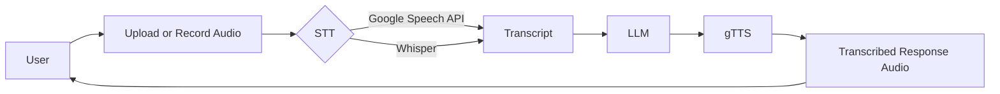
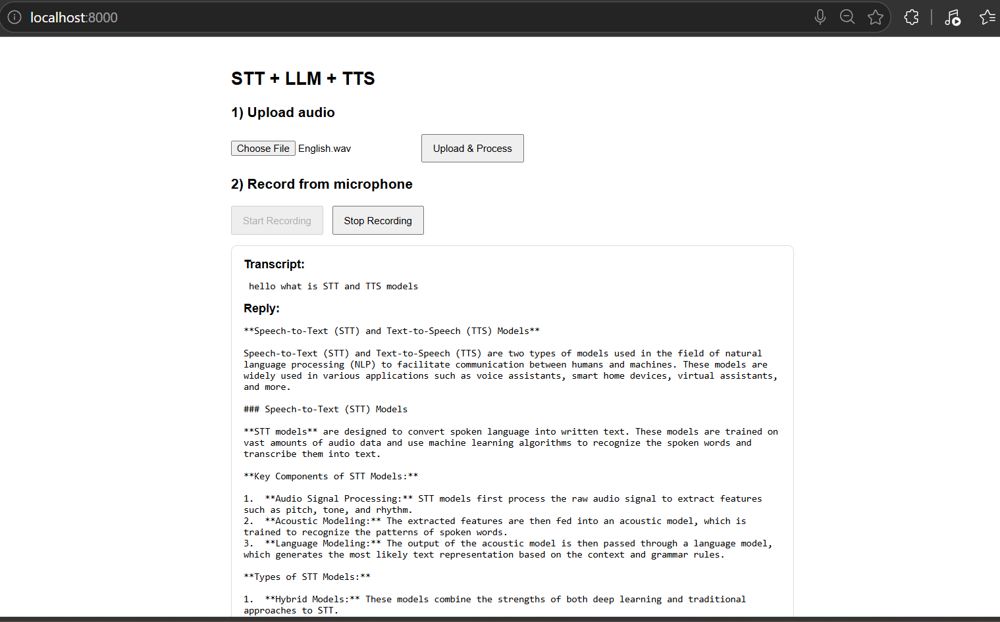

# SpeechChatbot (FastAPI STT + LLM + TTS Pipeline)

## Project Summary

SpeechChatbot is a lightweight voice chatbot built with:

- FastAPI backend
- Whisper-based speech-to-text (`Groq` audio translation endpoint)
- LLM response generation (`llama-3.1-8b-instant` via `langchain_groq`)
- Google Text-to-Speech (`gTTS`)

Users can:

- upload an audio file, or
- record directly from the browser microphone

and receive a transcript, assistant reply, and generated speech playback.

## Features

- Audio upload support for `.wav`, `.mp3`, `.webm`, `.ogg`, `.m4a`
- Browser microphone recording
- Async FastAPI route `/api/process` for processing one audio input
- Returns:
  - `transcript`
  - `reply`
  - Base64 audio payload (`audio_data`) for playback

## Quick Start

1. Create a virtual environment and install dependencies:

```bash
pip install -r requirements.txt
```

2. Set required environment variable:

```bash
GROQCLOUD_API_KEY=your_groq_api_key
```

3. Run the API:

```bash
uvicorn main:app --reload
```

4. Open the UI:

```text
http://127.0.0.1:8000/
```

## API Overview

| Endpoint | Method | Input | Output | Description |
|---|---|---|---|---|
| `/` | `GET` | - | HTML page | Serves `templates/index.html` |
| `/api/process` | `POST` | `audio_file` (`UploadFile`) | JSON: `transcript`, `reply`, `audio_data` | Runs STT -> LLM -> TTS workflow |

## Simple Pipeline (ERD Replacement)

This repo does not use a database, so we keep the architecture intentionally simple:

```text
Upload/Record Audio -> STT (Google Speech API or Whisper) -> LLM -> gTTS -> Audio Reply
```

### Simple Workflow Diagram



## Project Files

| Path | Purpose |
|---|---|
| `main.py` | FastAPI app + routing + audio processing orchestration |
| `STT_To_TTS.py` | Core helper functions for STT, LLM, and TTS |
| `templates/index.html` | Browser UI for upload/record and playback |
| `requirements.txt` | Python dependencies |
| `data/image.png` | Testing screenshot / visual evidence |
| `data/Testing.mp4` | Testing walkthrough video |

## Testing Video & Image



<video controls width="720" src="https://raw.githubusercontent.com/Engineer-Mohsin-Shah/SpeechChatbot-STT-LLM-TTS/main/data/Testing.mp4">
  Download/Watch Testing Video (MP4)
</video>

[Download the testing video (raw link)](https://raw.githubusercontent.com/Engineer-Mohsin-Shah/SpeechChatbot-STT-LLM-TTS/main/data/Testing.mp4)

## Notes

- The API validates incoming file extensions before processing.
- Temporary audio files are deleted after request completion.
- `STT_To_TTS.py` includes additional local/alternative helper functions for future expansion (e.g., microphone recording via `pyaudio`).

## Suggested Environment

- Python 3.12+
- Stable internet for Whisper/LLM/TTS services
- Microphone permission for browser recording
